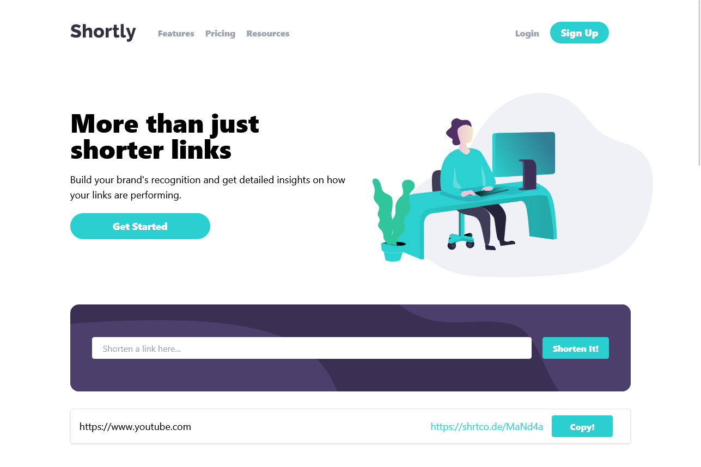
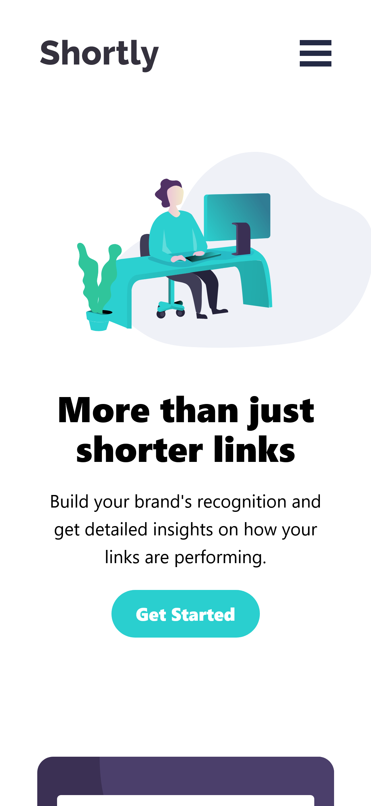

# Frontend Mentor - Shortly URL shortening API Challenge solution

This is a solution to the [Shortly URL shortening API Challenge challenge on Frontend Mentor](https://www.frontendmentor.io/challenges/url-shortening-api-landing-page-2ce3ob-G). Frontend Mentor challenges help you improve your coding skills by building realistic projects.

## Table of contents

- [Overview](#overview)
  - [The challenge](#the-challenge)
  - [Screenshot](#screenshot)
  - [Links](#links)
- [My process](#my-process)
  - [Built with](#built-with)
  - [Continued development](#continued-development)
  - [Useful resources](#useful-resources)
- [Author](#author)

**Note: Delete this note and update the table of contents based on what sections you keep.**

## Overview

### The challenge

Users should be able to:

- View the optimal layout for the site depending on their device's screen size
- Shorten any valid URL
- See a list of their shortened links, even after refreshing the browser
- Copy the shortened link to their clipboard in a single click
- Receive an error message when the `form` is submitted if:
  - The `input` field is empty

### Screenshot

### Links

- Solution URL: [Github Repo](https://github.com/AakashSahani/urlshortener)
- Live Site URL: [Live Preview](https://urlshortener-sandy.vercel.app/)

## My process

### Built with

- Semantic HTML5 markup
- Tailwind CSS
- Flexbox
- CSS Grid
- Mobile-first workflow
- [React](https://reactjs.org/) - JS library

### Continued development

I want to focus more in Responsive Design.

### Useful resources

- [TailwindCSS](https://tailwindcss.com/) - This site is a must for those who prefer to use TailwindCSS

- [MDN Docs](https://developer.mozilla.org/en-US/) - This is an amazing web documentation maintained
  by Mozilla. It helped me a learn a lot about web standards and best practices.

## Author

- Website - [Aakash Sahani](https://www.aakashsahani.com)
- Frontend Mentor - [@aakashsahani](https://www.frontendmentor.io/profile/aakashsahani)
- LinkedIn - [@AakashSahani](https://www.linkedin.com/in/aakash-sahani)
